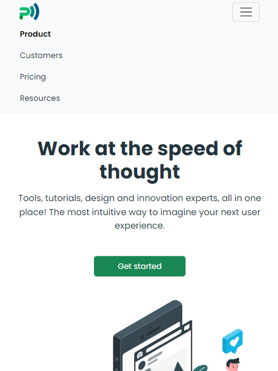

# Buisness
Одностраничник адаптируемый на разные разрешения экрана был преимущественно использован boostrap.
## Технологии


## Bootstrap
В headere был использован bootstrap, при уменьшении разрешения до 992px на экране выходит кнопка с навигацией. 
``` html
    <header class="bg-body-tertiary mb-5">
        <div class="container">
            <nav class="navbar navbar-expand-lg">
                <div class="container-fluid">
                    <a class="navbar-brand" href="#">
                        
                    </a>
                    <button class="navbar-toggler" type="button" data-bs-toggle="collapse" data-bs-target="#navbarNav"
                        aria-controls="navbarNav" aria-expanded="false" aria-label="Toggle navigation">
                        <span class="navbar-toggler-icon"></span>
                    </button>
                    <div class="collapse navbar-collapse flex-grow-0" id="navbarNav">
                        <ul class="navbar-nav">
                            <li class="nav-item me-2">
                                <a class="nav-link active fw-semibold" href="#">Product</a>
                            </li>
                            <li class="nav-item me-2">
                                <a class="nav-link" href="#">Customers</a>
                            </li>
                            <li class="nav-item me-2">
                                <a class="nav-link" href="#">Pricing</a>
                            </li>
                            <li class="nav-item">
                                <a class="nav-link" href="#">Resources</a>
                            </li>
                        </ul>
                    </div>
                </div>
            </nav>
        </div>
    </header>

```


## Команда проекта


- [Макыев Данияр] — Front-End developer

## Источники
[Figma](https://www.figma.com/file/m4DBeT47VkwQlFKozHDcK5/NewProject?node-id=4%3A2)

